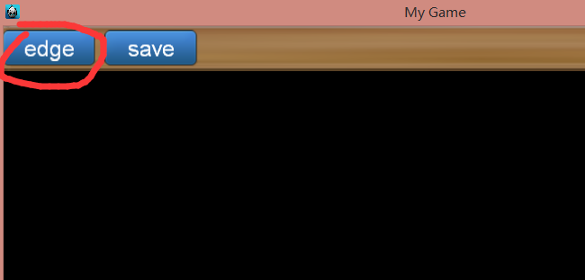
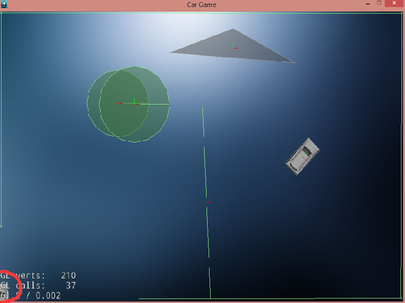

# Box2dDesigner
1. how to use ?
2. how to compile ?
3. how to use xml file generate by Box2dDesigner?
4. feature table.

## how to use ?
####1. open Box2DDesigner.exe in Box2DDesigner/exe
 
	 

####2. draw a line body in world. click mouse left key to draw the point, and then move mouse to another place, and click mouse left key again, now you create a line body in the world. (two click point decide a line body)
 
	 
 
	 
####3. now move you mouse to top of the window, and then you will see a main menu show out. click the 'edge' button, you will see it change to 'circle', and click again, it will change to 'chain'. the button is mode button. it decide which shape you are drawing, and now you choose 'chain', means you will draw a chain when you click left mouse on the window.
 
	 
 
	 
####use chain to draw a borad of the window, but left bottom part is open. 
 
	 
####and then click mouse middle key to make sure what you are drawing. 
 
	 
####click the mode button and change mode to 'circle'. 
 
	 
####and click you mouse left key to draw a circle, you need click two times to make a line, and the line is radius of the circle. 
 
	 
####4. click the mode button and change mode to 'polygon', and click you mouse left key to draw a polygon. 
 
	 
####5. then move you mouse on the right cicle, and click you mouse left key, and you will see the 'attibute menu' show on the right of window. 
 
	 
####you can change the attibute, such as change the positionX of the circle, i change it to 10, you can see the difference. 
 
	 
####6. move you mouse to top of the window, and click save(mouse left key) to save these body.  
 
	 
####the default save path is c:/user/xxx/AppData/Local/Box2DDesigner (actually it is the last folder if the name of you Box2DDesigner exe file.) 
 
	 
####7. use the xml file to you cocos2dx game. 
run the Box2DDesigner\exe\cargame.exe, you can seee what you have designed is now show in the game. 
(the game is default load xml file in c:/user/xxx/AppData/Local/Box2DDesigner/bos2ddesignerComplete.xml)  
	 
####now you can use ↑ ↓ ← → key on you keyboard to control the car in the left and bottom conner. 
 
	 
	
## how to compile ?
1. create a cocos2d-x3.6 project.(if you do not know how to create it, you can visit from http://www.cnblogs.com/hll2008/p/4227277.html
and http://jingyan.baidu.com/article/8275fc86ba986346a13cf66d.html  

	 

2. copy code to project.
	copy source code in src to you project. Classes folder to your classes folder and Resources to you Resources folder.  

	
	

3. add classes to you project in vs. 
	  
	

4. modify "AppDelegate.cpp", change current sence to Box2DDesignerScene. 
	
	

5. run the project. now you can see the Box2Ddesigner window 
	

## how to use xml file generate by Box2dDesigner?
after create box2d object b2World, you can use function of Box2DDesigner to load xml file.

 
	b2World* world = new b2World(b2Vec2(0, 0));
	Box2DDesignerScene::readCompleteDataFromXML(this, world, "", true);
 
	
	readCompleteDataFromXML :
	1st argument is current scene;
	2nd argument is btWorld;
	3rd argument is xml file path, default is "c:/user/xxx/AppData/Local/cocos2d-project-name";
	4th argument is true, you will load the sence attrubute to you current scene.

## feature table
### main menu
####1. mode : edge, circle, chain, polygon.
####edge
 
	 
####circle
 
	 
####chain
 
	 
####polygon
 
	 
####2. save
 
	the file is saved in c:/user/xxx/AppData/Local/cocos2d-project-name  
	 
	box2ddesigner.xml is only save physic body's position, other attribute use default value. 
	box2ddesignerComplete.xml will save all setting for physic body.

### mouse interaction
1. when mouse is moving on a physic body 
<table>
<tr><td>click key</td><td>move</td><td>no move</td></tr>
<tr><td>left</td><td>move body</td><td>show attibute menu</td></tr>
<tr><td>right</td><td></td><td>delete point(when draw) or delete body(when not draw)</td></tr>
<tr><td>midle</td><td></td><td>complete chain body(when in chain mode) or not useful</td></tr>
<tr><td>none</td><td></td><td>show main menu when move on top of the windows</td></tr>
</table>
2. when mouse is not moving on a physic body 
	<table>
<tr><td>click key</td><td>move</td><td>no move</td></tr>
<tr><td>left</td><td>move all layer</td><td></td></tr>
<tr><td>right</td><td></td><td>delete point(when draw) or no useful(when not draw)</td></tr>
<tr><td>midle</td><td></td><td>complete chain body(when in chain mode) or not useful</td></tr>
<tr><td>none</td><td></td><td>show main menu when move on top of the windows</td></tr>
</table>
3. roll mouse wheel is using to scale the layer. 